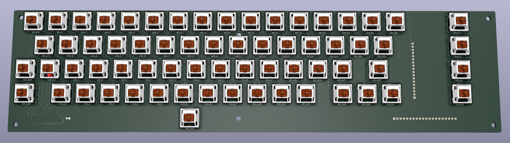
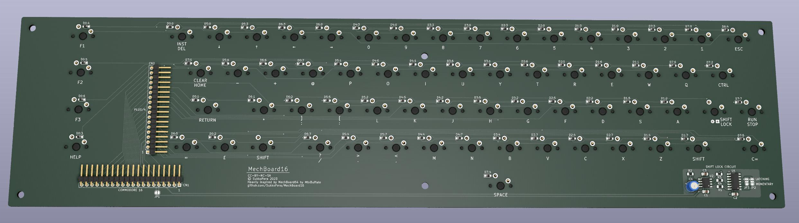

# MechBoard16
MechBoard16 is a mechanical replacement keyboard for the Commodore 16.

The project is Heavily inspired by [MechBoard64 by MtnBuffalo](https://www.breadbox64.com/blog/the-mechboard64/).

# WORK IN PROGRESS!!!

